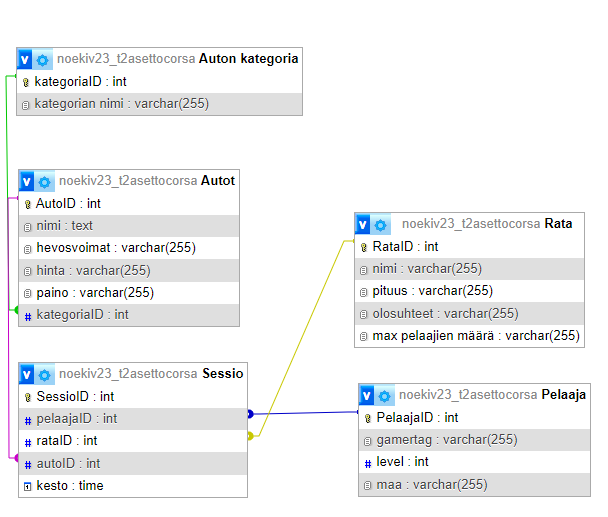

# Videopeli (asetto corsa)

## yleistä

Pelissä Ajetaan autoilla rataa

## rakenne

## kyselyt

### 1. Laadi kysely jossa haet kaikki tietyn taulun tiedot, lajittele sopivan kentän mukaan.

SELECT * FROM `Pelaaja`
ORDER BY `gamertag`;

### 2. Laadi kysely jossa haet tietoja kahdesta tai useammasta taulusta INNER JOIN-liitoksen avulla.

SELECT `Pelaaja`.`gamertag`, `Rata`.`nimi` AS `rata_nimi`, `Autot`.`nimi` AS `auto_nimi`, `Sessio`.`kesto`
FROM `Sessio`
INNER JOIN `Pelaaja` ON `Sessio`.`pelaajaID` = `Pelaaja`.`PelaajaID`
INNER JOIN `Rata` ON `Sessio`.`rataID` = `Rata`.`RataID`
INNER JOIN `Autot` ON `Sessio`.`autoID` = `Autot`.`AutoID`;

### 3. Laadi kysely jossa käytät funktiota. Voit esimerkiksi hakea tietyn taulun tietueitten lukumäärän.

SELECT COUNT(*) AS `total_pelaajat`
FROM `Pelaaja`;

### 4. Laadi kysely jossa käytät funktiota ja ryhmittelet tiedot.

SELECT `maa`, COUNT(*) AS `pelaaja_count`
FROM `Pelaaja`
GROUP BY `maa`;

### 5. Laadi yksi INSERT-kysely jossa lisäät testitietueen.

INSERT INTO `Pelaaja` (`gamertag`, `level`, `maa`) 
VALUES ('TestGamer', 1, 'testimaa');

### 6. Laadi yksi UPDATE-kysely jossa päivität testitietuetta.

UPDATE `Pelaaja`
SET `level` = 10, `maa` = 'updated_maa'
WHERE `gamertag` = 'TestGamer';

### 7. Laadi yksi DELETE-kysely jossa poistat testitietueen.

DELETE FROM `Pelaaja`
WHERE `gamertag` = 'TestGamer';
